# PowerPoint with Joe

  Business Presentations
  Data Storytelling
  Strategy
  Presentation Design

Hi, I'm Joseph Christopher. Welcome to my PowerPoint portfolio.

I put this together to show how I approach a business presentation from start to finish. That includes the structure, content, data, charts, visual design, and final quality check.

For this case study, I created a 17 slide executive presentation around a fictional B2B company.

The goal was simple:

> Take a large amount of business information and turn it into a presentation that management can quickly understand and act on.

The company data used in this project is illustrative and was created for this portfolio.

# Business Performance & Growth Strategy

## Executive Management Presentation

This project looks at a growing business that is doing well on revenue but is facing pressure around profit margin, customer retention, acquisition costs, and operational efficiency.

I built the presentation around three main questions:

1. What is happening in the business?
2. What's driving the performance?
3. What should management do next?

Below is the full presentation and a quick breakdown of what I did on each slide.

## 01: Cover

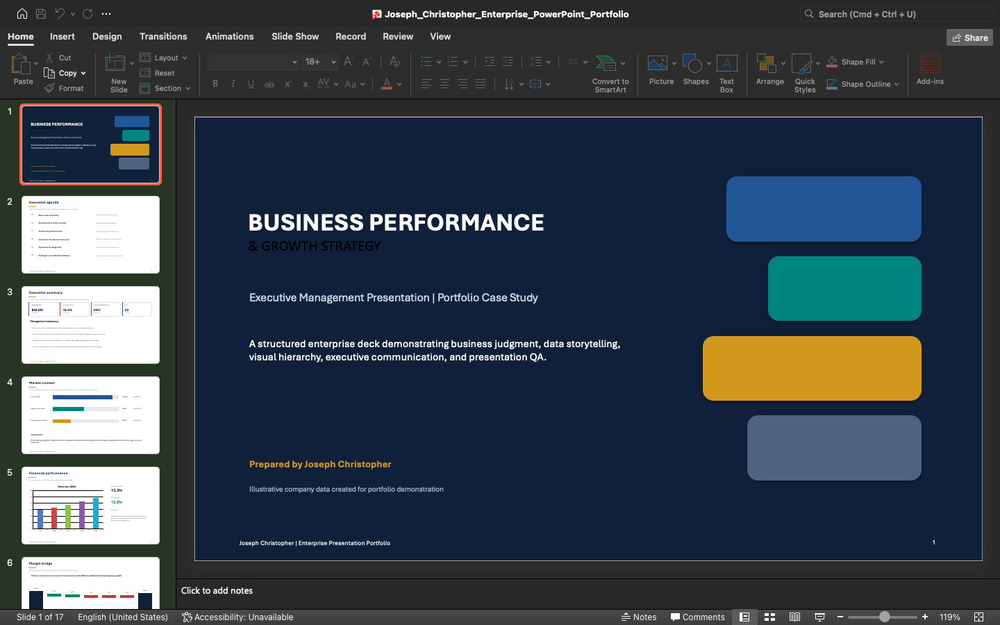

I kept the opening slide simple and professional.

The title makes the subject clear right away, while the subtitle explains that this is an executive management case study.

I used a dark background with a small set of accent colors that continue throughout the presentation. This helped me set the visual style without making the cover too busy.

**What I worked on:** Visual hierarchy, typography, spacing, color system, and overall presentation style.

## 02: Executive Agenda

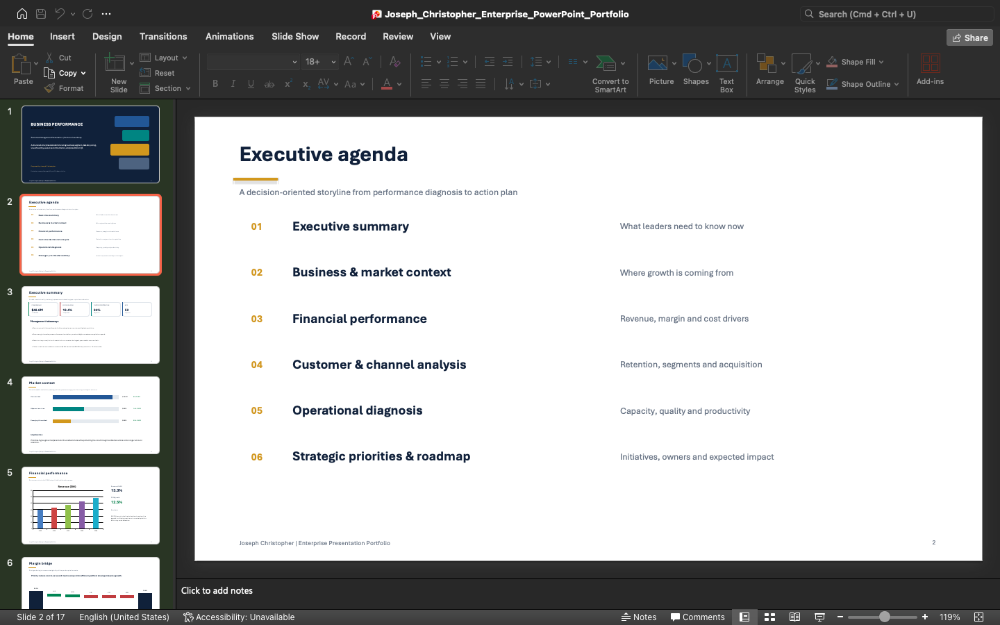

I used this slide to give the audience a clear idea of where the presentation is going before getting into the numbers.

I organized the story into six main areas:

1. Executive summary
2. Business and market context
3. Financial performance
4. Customer and channel analysis
5. Operational diagnosis
6. Strategic priorities and roadmap

I also added a short explanation beside each section so the audience can quickly understand what each part covers.

**What I worked on:** Presentation structure, storyline, information hierarchy, spacing, and readability.

## 03: Executive Summary

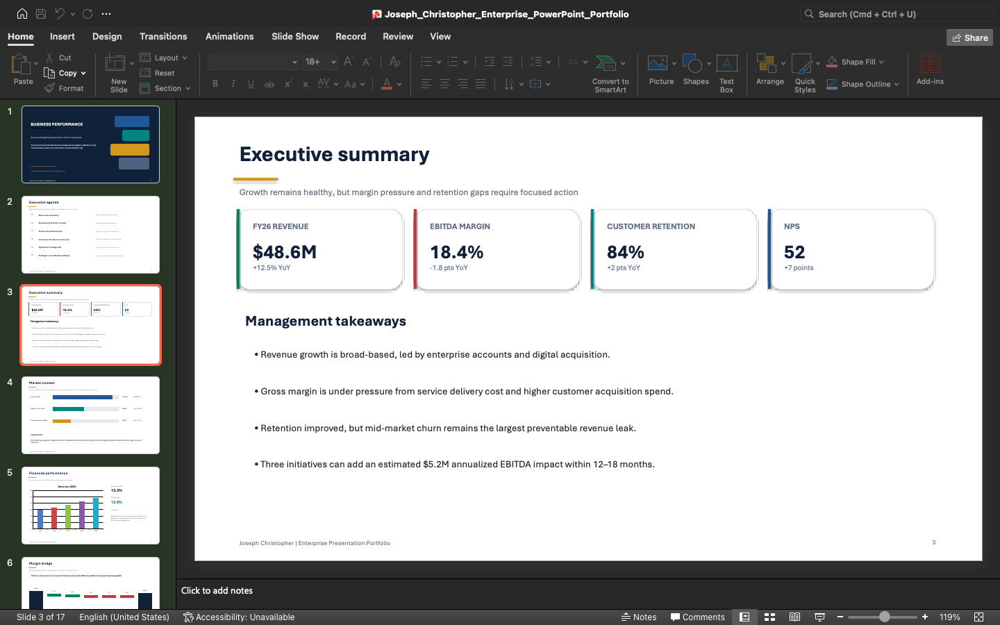

This is one of the most important slides in the presentation.

Instead of making management go through the whole deck before understanding the situation, I brought the main numbers to the front.

The slide highlights $48.6M in revenue, an 18.4% EBITDA margin, 84% customer retention, and an NPS of 52.

Below the KPIs, I summarized the main business takeaways in simple language.

The idea was to make sure someone could look at this slide alone and still understand the current state of the business.

**What I worked on:** KPI presentation, executive summary writing, visual hierarchy, business communication, and turning analysis into clear takeaways.

## 04: Market Context

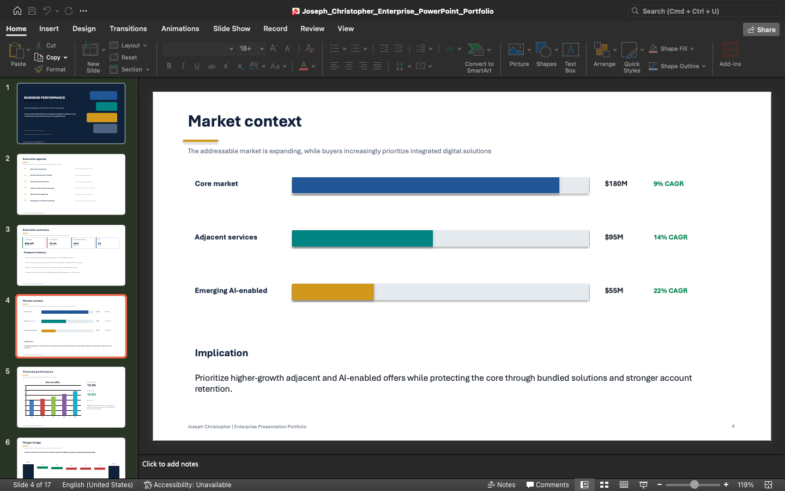

Here I moved from the company's internal performance to the bigger market opportunity.

I compared three areas: the core market, adjacent services, and emerging AI enabled services.

Instead of putting everything into a large table, I used horizontal bars to make the market sizes easy to compare. I also included the growth rate for each area.

The main point is that the biggest market isn't automatically the biggest future opportunity. The growth rates help show where the company may find stronger opportunities going forward.

I finished the slide with a short business implication so the data leads to an actual recommendation.

**What I worked on:** Market comparison, data visualization, chart layout, data storytelling, and business interpretation.

## 05: Financial Performance

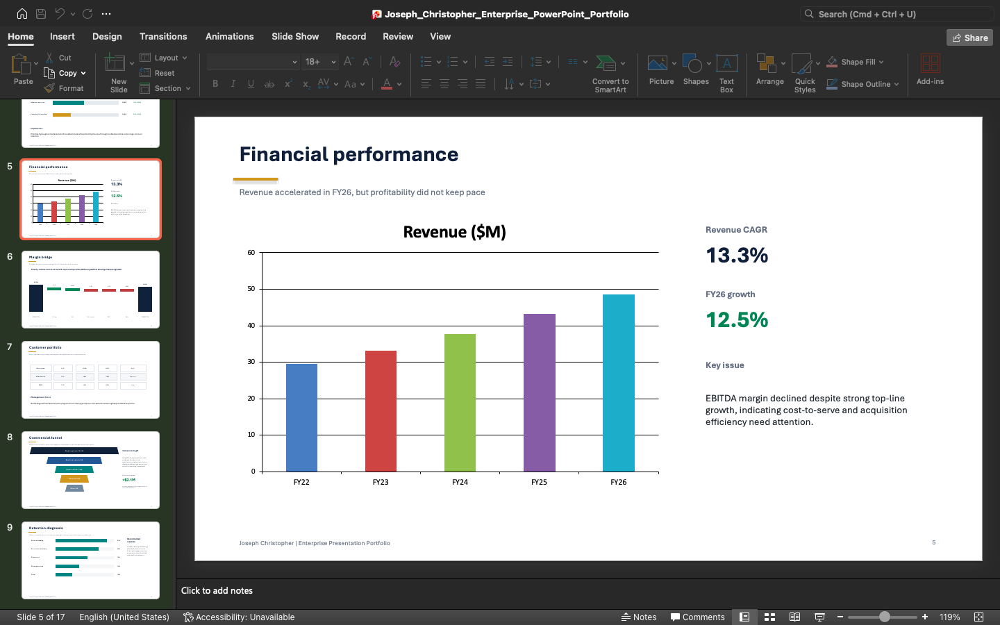

This slide shows how revenue changed from FY22 to FY26.

Revenue grew from $29.5M to $48.6M, with a 13.3% CAGR and 12.5% growth in FY26.

But I didn't want the message to stop at "revenue is growing."

I also highlighted that profitability wasn't keeping up with the top line growth. That gives the audience a reason to look deeper into what is affecting the margin.

**What I worked on:** Financial storytelling, trend analysis, chart design, KPI callouts, and identifying the main issue behind the numbers.

## 06: Margin Bridge

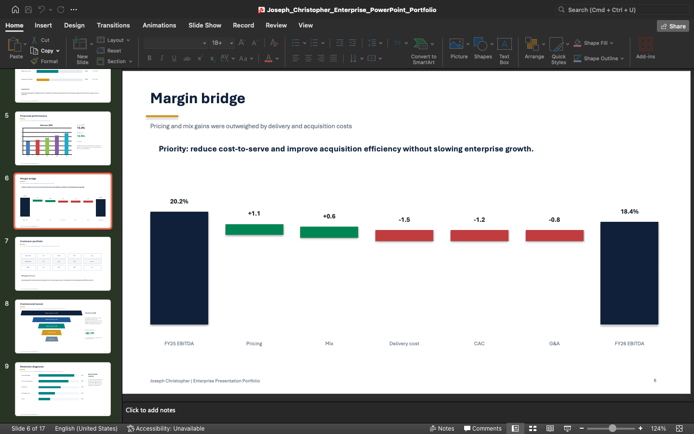

This slide explains why EBITDA margin moved from 20.2% to 18.4%.

I separated the positive and negative drivers so it's easy to see what helped and what hurt performance.

Pricing and mix helped the business, while delivery costs, customer acquisition costs, and G&A pulled the margin down.

This makes the story clearer. The business isn't struggling to grow revenue. The bigger issue is how much it's spending to deliver and acquire that revenue.

**What I worked on:** Variance analysis, financial communication, cause and effect storytelling, and simplifying multiple financial drivers.

## 07: Customer Portfolio

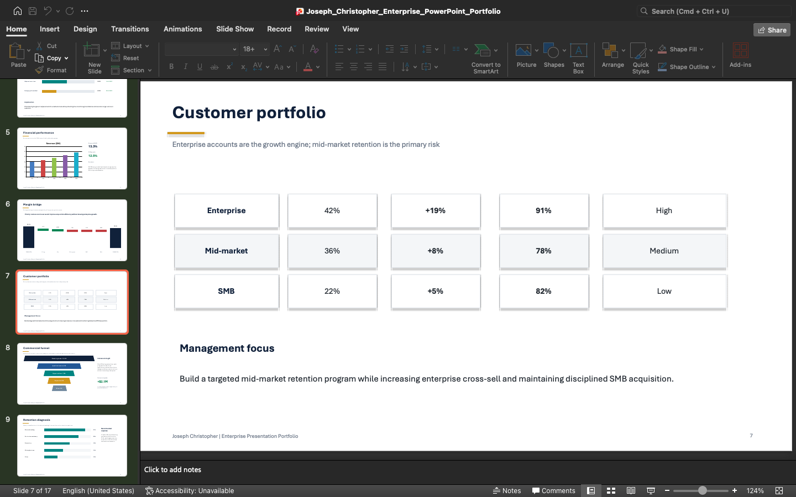

Here I compared the company's Enterprise, Mid market, and SMB customer groups.

I looked at revenue mix, year over year growth, retention, and strategic value.

The numbers show that Enterprise customers are the strongest growth area, while Mid market retention needs more attention.

I then turned that finding into a management recommendation: protect the Mid market customer base while continuing to grow Enterprise accounts.

**What I worked on:** Customer segmentation, table design, comparative analysis, business interpretation, and management recommendations.

## 08: Commercial Funnel

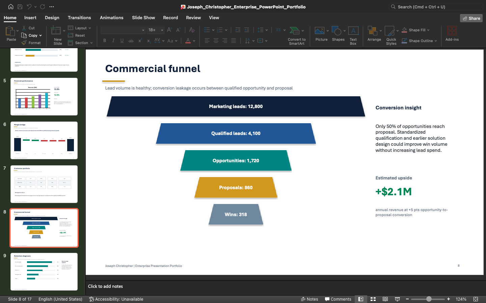

This slide follows the sales journey from 12,800 marketing leads down to 318 wins.

I didn't just want to show the funnel. I wanted to identify where the biggest opportunity was.

The analysis shows a major drop between opportunities and proposals.

I then connected that gap to a possible $2.1M annual revenue upside if the company can improve that conversion point.

**What I worked on:** Funnel analysis, conversion performance, opportunity sizing, visual storytelling, and connecting operational data to financial impact.

## 09: Retention Diagnosis

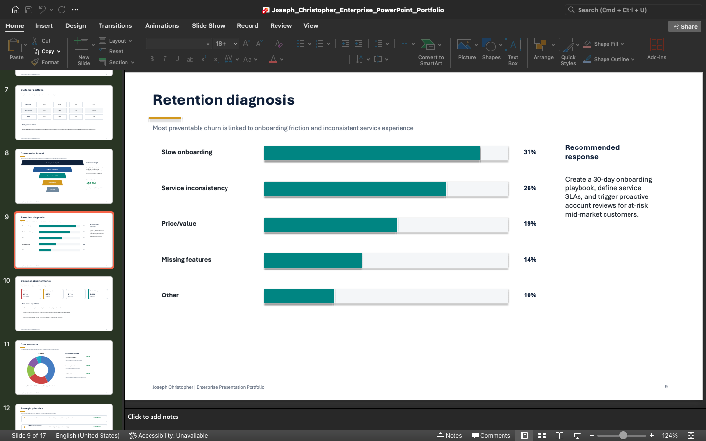

After identifying retention as an issue, I used this slide to look at why customers are leaving.

Slow onboarding is the biggest reason at 31%, followed by service inconsistency at 26%.

I used horizontal bars so the audience can quickly compare the different causes.

I also added a practical response instead of stopping at the problem: improve the first 30 days of onboarding, set clearer service standards, and identify at risk customers earlier.

**What I worked on:** Root cause analysis, customer experience data, chart design, and turning findings into practical actions.

## 10: Operational Performance

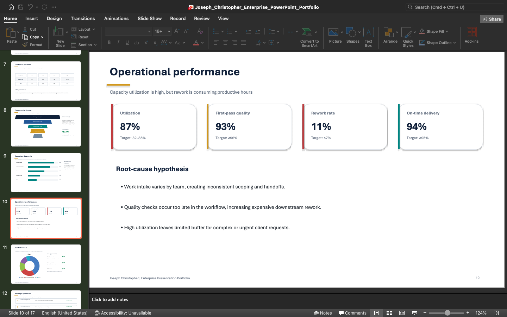

This slide looks at what is happening inside the company's operation.

I compared actual performance with targets across utilization, first pass quality, rework, and on time delivery.

The numbers show an important issue: utilization is already high, but quality and rework are still below target.

That suggests the company doesn't only have a capacity issue. There are also problems with the workflow and quality process.

**What I worked on:** Operational KPIs, target comparison, quality analysis, root cause thinking, and executive communication.

## 11: Cost Structure

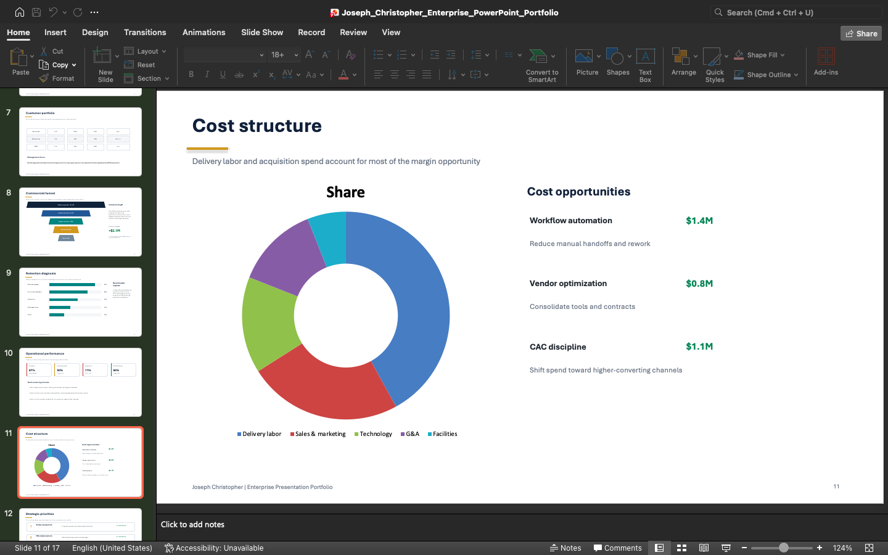

This slide breaks down where the company's costs are going and where management may be able to improve efficiency.

I paired the cost breakdown with three specific opportunities: workflow automation, vendor optimization, and better customer acquisition cost control.

Each opportunity also includes an estimated financial impact.

That way, the slide doesn't just explain where the company is spending money. It also shows where management can take action.

**What I worked on:** Cost analysis, financial visualization, opportunity sizing, and connecting cost drivers to possible savings.

## 12: Strategic Priorities

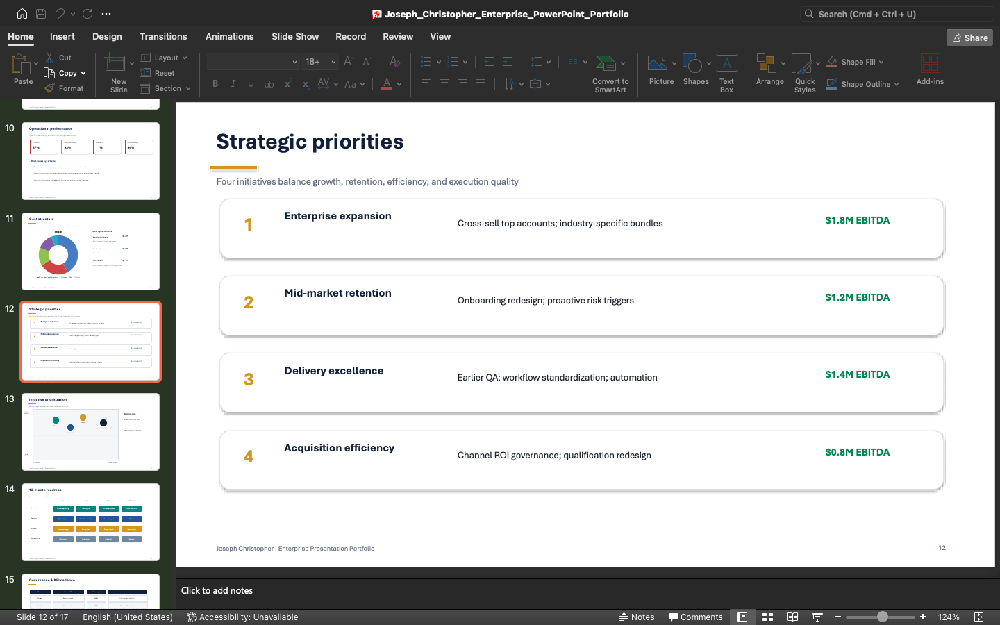

At this point in the presentation, the main problems have already been identified.

I used this slide to turn all that analysis into four clear priorities:

1. Enterprise expansion
2. Mid market retention
3. Delivery excellence
4. Acquisition efficiency

I also included the estimated EBITDA impact of each priority.

This is where the presentation moves from explaining the problems to showing what management should actually do about them.

**What I worked on:** Strategy, recommendation writing, prioritization, layout, and communicating financial impact.

## 13: Initiative Prioritization

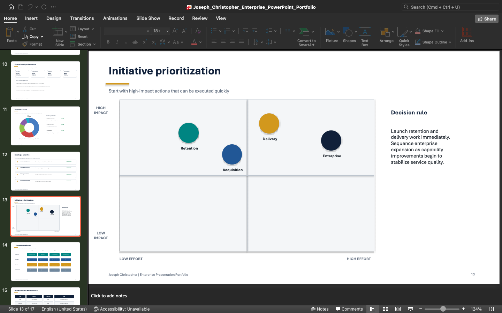

Not every good idea needs to happen at the same time.

I used an impact versus effort matrix to compare the initiatives and show which ones should move first.

Retention and delivery improvements offer a strong balance between impact and effort. Larger growth initiatives can follow as the company's operational foundation becomes stronger.

**What I worked on:** Prioritization, decision making, impact versus effort analysis, and strategy communication.

## 14: 12 Month Roadmap

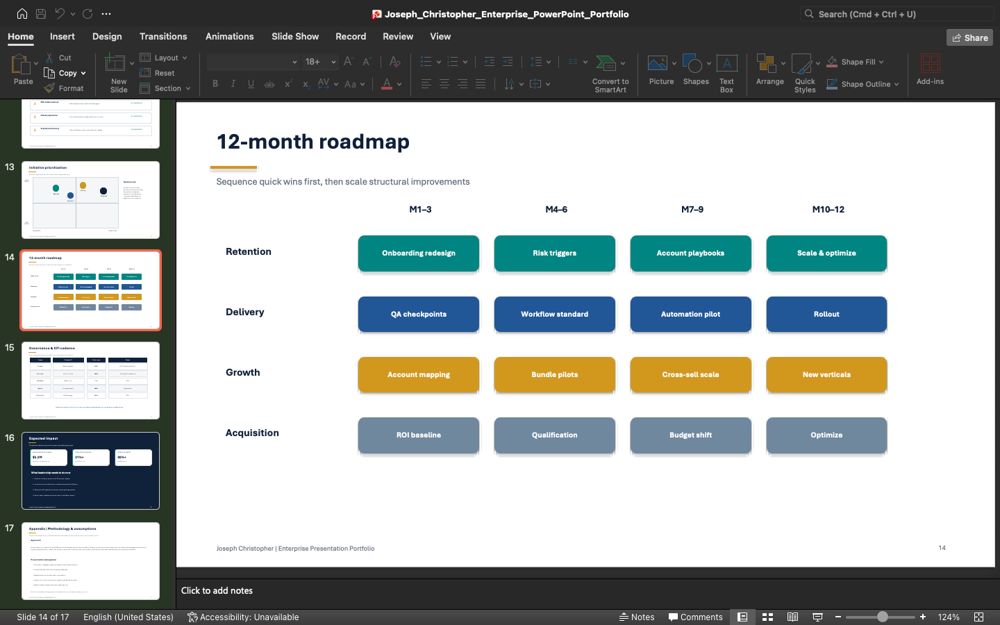

A recommendation isn't very useful if nobody knows what happens next.

I turned the strategy into a 12 month roadmap covering four workstreams: Retention, Delivery, Growth, and Acquisition.

The roadmap shows what should happen across months 1 to 3, 4 to 6, 7 to 9, and 10 to 12.

This gives management a clear view of how the strategy can move from an idea to actual execution.

**What I worked on:** Implementation planning, sequencing, roadmap design, information organization, and turning strategy into action.

## 15: Governance & KPI Cadence

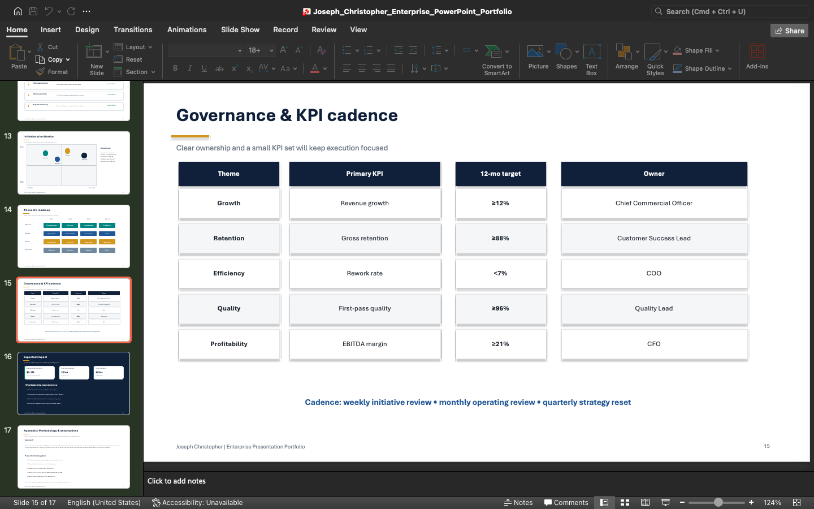

This slide answers another important question:

> How do we know the plan is actually working?

I assigned a main KPI, a 12 month target, and an owner to each major area.

The targets include revenue growth of at least 12%, gross retention of at least 88%, rework below 7%, first pass quality of at least 96%, and an EBITDA margin of at least 21%.

I also included weekly, monthly, and quarterly review points so performance can be tracked over time.

**What I worked on:** KPI design, accountability, governance, target setting, and management reporting.

## 16: Expected Impact

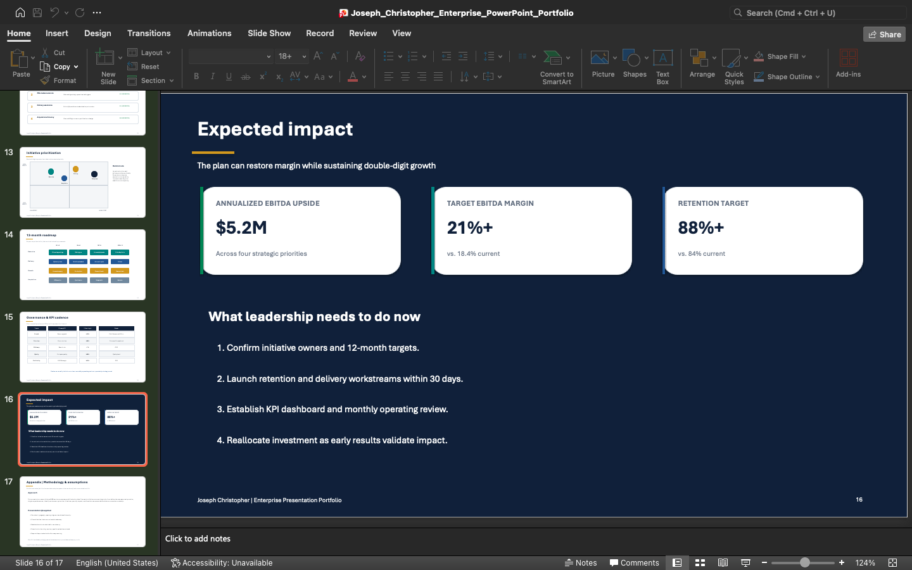

This slide brings the full business case together.

The plan targets $5.2M in annualized EBITDA upside, an EBITDA margin above 21%, and customer retention above 88%.

I also included four immediate actions for leadership.

I wanted the presentation to finish with a clear next step instead of ending with another chart or a general summary.

**What I worked on:** Executive communication, financial impact, summary design, visual hierarchy, and clear calls to action.

## 17: Methodology & Assumptions

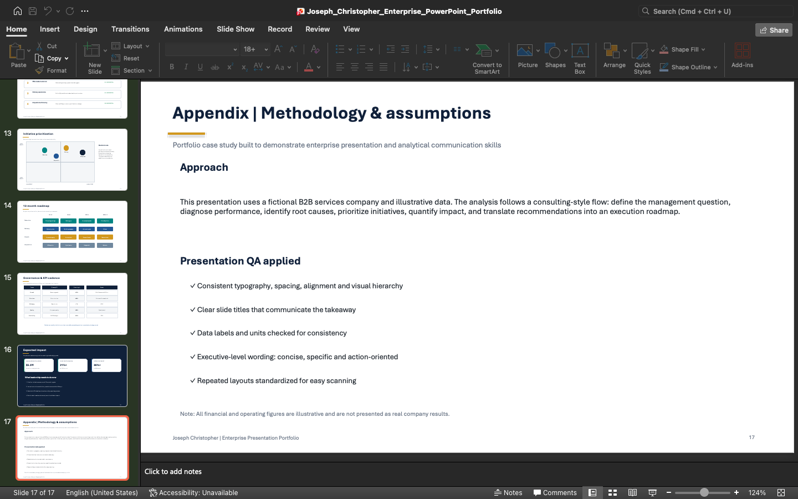

I used the final slide to explain how I approached the project and how I reviewed the presentation.

The analysis followed a simple flow:

**Understand the question → Diagnose performance → Find the causes → Prioritize actions → Estimate the impact → Build the roadmap**

I also reviewed the presentation for typography, spacing, alignment, visual hierarchy, slide titles, data labels, units, wording, and layout consistency.

All financial and operating figures used in this case study are illustrative.

**What I worked on:** Presentation QA, consistency, methodology, transparency, and final review.

# What This Project Shows

This project isn't only about making slides look good.

It shows how I work across the full presentation process:

* Organizing a business story
* Working with financial and operational data
* Finding the important points
* Turning numbers into clear visuals
* Writing executive takeaways
* Building visual hierarchy
* Keeping the whole deck consistent
* Turning analysis into recommendations
* Building an implementation roadmap
* Reviewing the final presentation for quality

# Tools I Work With

* Microsoft PowerPoint
* Microsoft Excel
* Google Slides
* Google Sheets
* Figma
* Adobe Photoshop
* AI and LLM tools

# About Me

I'm Joseph Christopher.

My background covers presentation and visual design, web development, AI evaluation, data annotation, content review, and quality assurance.

I enjoy working with information that needs to be organized, cleaned up, checked, and presented in a way that's easy for someone else to understand.

That's the same approach I bring to PowerPoint.

LinkedIn: https://www.linkedin.com/in/joseph-christopher-51334926b/

Email: josephchris3a3@gmail.com

# PowerPoint with Joe

Turning complex information into a clear story.
